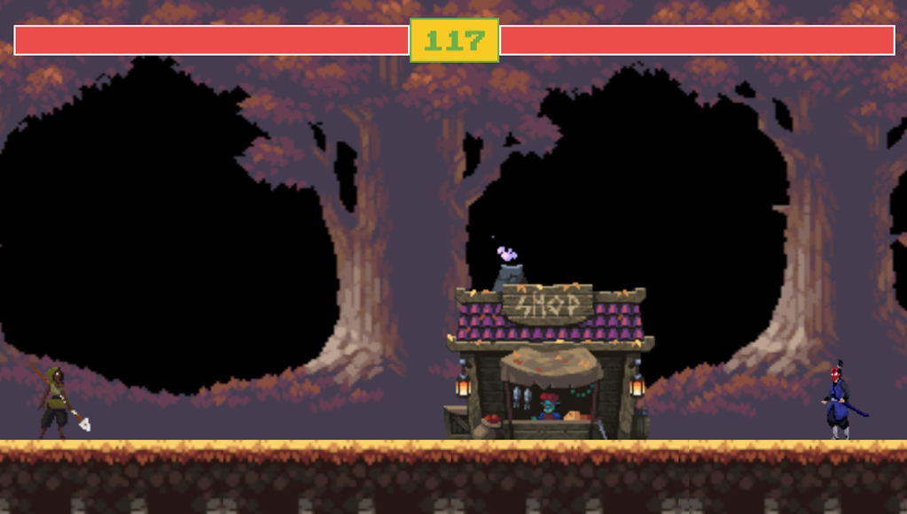

# _Javascript Fighting game with HTML canvas_

>## This is my first project on game.

This game is a fighting game. Fighting video games are games in which the player controls a character who engages in a duel with another character on a limited screen.Through this project for me to have more knowledge about html,css and javascript. How to DOM, work with canvas, act on javascript events, etc...

*This project is guided by* [Chris Courses](https://www.youtube.com/channel/UC9Yp2yz6-pwhQuPlIDV_mjA)
>## Screenshot

*Game begins*

*Fighting*

*End game*

